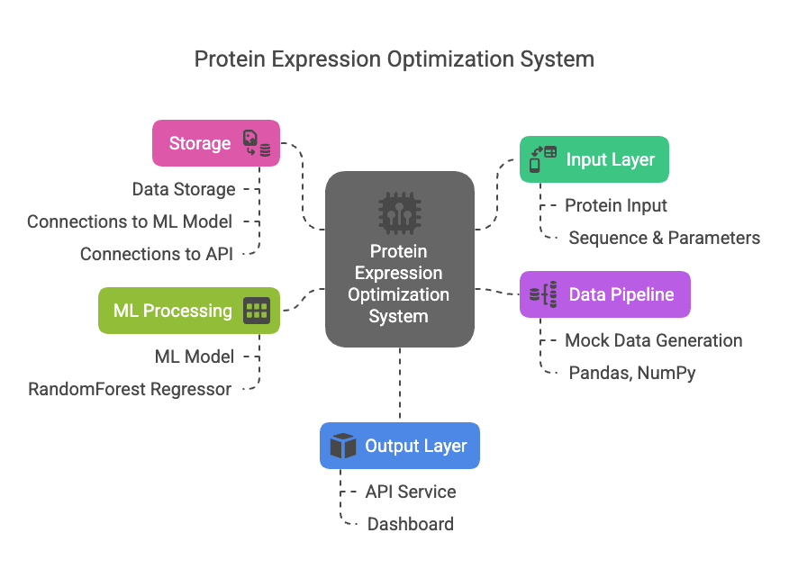

# Protein Expression Optimization System

[](https://www.python.org/downloads/)
[](https://fastapi.tiangolo.com/)
[](https://streamlit.io/)
[](https://scikit-learn.org/)
[](https://github.com/psf/black)
[](https://opensource.org/licenses/MIT)

A data-driven platform that helps researchers optimize protein expression conditions using machine learning. This tool predicts expression levels and solubility based on experimental parameters, helping streamline the protein production process.



## What's Inside

```
protein_optimizer/
├── dashboard/          # Streamlit-based visualization interface
├── src/
│   ├── api/           # FastAPI backend service
│   ├── data_pipeline/ # Data generation and processing
│   └── ml_models/     # Expression prediction models
└── tests/             # Test coverage
```

## Key Features

- **Smart Predictions**: Uses RandomForest models to predict protein expression levels and solubility
- **Interactive Dashboard**: Real-time visualization of expression data and predictions
- **REST API**: Easy integration with existing lab workflows
- **Rapid Prototyping**: Built-in mock data generation for testing and development

## Getting Started

1. Set up your environment:
```bash
python -m venv venv
source venv/bin/activate  # On Windows: venv\Scripts\activate
```

2. Install the package with development dependencies:
```bash
pip install -e ".[dev]"
```

This will install all required packages including:
- Core dependencies (pandas, numpy, scikit-learn, etc.)
- API dependencies (FastAPI, uvicorn)
- Visualization dependencies (streamlit, plotly)
- Development tools (pytest, black, mypy)

Note: Every time you open a new terminal or IDE session, you'll need to reactivate the virtual environment:
```bash
# Navigate to the project directory
cd /path/to/protein-optimizer

# Activate the virtual environment
source venv/bin/activate  # On Windows: venv\Scripts\activate

# You should see (venv) in your terminal prompt when it's activated
```

3. Start the prediction service:
```bash
uvicorn src.api.main:app --reload
```

4. Launch the dashboard:
```bash
streamlit run dashboard/app.py
```

The dashboard will be available at http://localhost:8501 and the API at http://localhost:8000.

## Development Guide

The project uses several development tools to ensure code quality:

### Testing
Run the test suite with coverage report:
```bash
pytest --cov=src tests/
```

### Code Formatting
Format your code using black:
```bash
black .
```

### Type Checking
Check type annotations with mypy:
```bash
mypy src/
```

### Configuration Files
- `pytest.ini`: Test configuration
- `mypy.ini`: Type checking settings
- `pyproject.toml`: Code formatting rules

## Future Roadmap

I'm planning to integrate with key bioinformatics resources:
- AlphaFold for structure prediction
- UniProt for protein properties
- PDB for structural data
- ESM-2 for sequence analysis
- BRENDA for enzyme data
- KEGG for pathway information

## Contributing

I welcome contributions! Feel free to open issues or submit pull requests that improve prediction accuracy, add new features, or enhance the user interface.

## License

MIT License - feel free to use and modify as needed.
