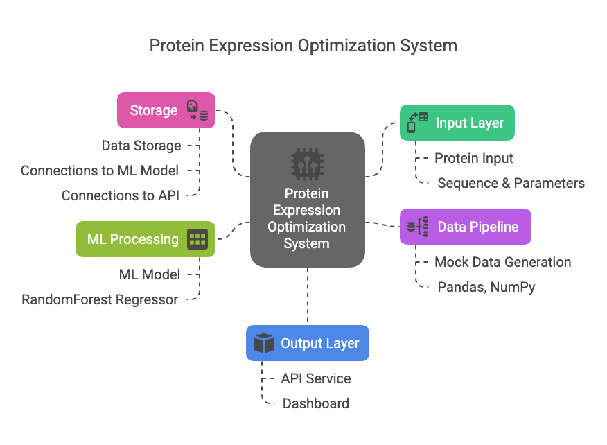

# Protein Expression Optimizer

[](https://www.python.org/downloads/)
[](https://fastapi.tiangolo.com/)
[](https://streamlit.io/)
[](https://scikit-learn.org/)
[](https://github.com/psf/black)
[](https://opensource.org/licenses/MIT)
[](https://github.com/keltoumboukra/protein-optimizer/actions/workflows/ci.yml)
[](https://codecov.io/gh/keltoumboukra/protein-optimizer)

A data-driven platform that helps researchers predict the presence of post-translational modification (PTM) sites—specifically, N-linked glycosylation sites—in proteins using real data from the EBI/UniProt Proteins API. The pipeline extracts biologically relevant features from protein annotations and sequence, enabling supervised machine learning for PTM site prediction. The project is designed to be extensible, with future plans to incorporate AlphaFold structural features.



## What's Inside

```
protein_optimizer/
├── dashboard/           # Streamlit-based visualization interface
│   └── app.py          # Main dashboard application with plotly visualizations
├── src/
│   ├── api/            # FastAPI backend service
│   │   └── main.py     # API endpoints and server configuration
│   ├── data_pipeline/  # Data collection and processing
│   │   ├── collector.py # Real data collection from EBI/UniProt
│   │   ├── processor.py # Data processing for ML
│   │   └── test_ptm_pipeline.py # End-to-end PTM prediction pipeline test
│   └── ml_models/      # Prediction models
│       └── predictor.py # Model code
├── tests/              # Comprehensive test suite
│   ├── test_api.py     # API endpoint tests
│   └── test_predictor.py # ML model and data processing tests
├── setup.py            # Package configuration and dependencies
├── pytest.ini          # Test configuration settings
├── mypy.ini           # Type checking configuration
└── pyproject.toml     # Code formatting and tool settings
```

## Key Features

- **PTM Site Prediction**: Uses RandomForest models to predict the presence of N-linked glycosylation sites (PTM type `CARBOHYD`) in proteins
- **Real Data Only**: All features and labels are derived from real protein data fetched from the EBI Proteins API. No mock or synthetic data is used.
- **Interactive Dashboard**: Real-time visualization of protein features and predictions
- **REST API**: Easy integration with existing lab workflows

## Features Used for Prediction
The following features are extracted for each protein:
- `sequence_length`: Number of amino acids in the protein sequence
- `molecular_weight`: Protein molecular mass (from UniProt annotation)
- `n_cysteines`: Number of cysteine residues in the sequence
- `n_domains`: Number of annotated domains
- `n_disulfide_bonds`: Number of annotated disulfide bonds
- `has_signal_peptide`: 1 if a signal peptide is annotated, else 0
- `has_transmem`: 1 if a transmembrane region is annotated, else 0
- `protein_existence`: Evidence level for protein existence
- `taxonomy_id`: NCBI taxonomy ID for the organism
- `ptm_label`: 1 if at least one N-linked glycosylation site is annotated, else 0

## Data Pipeline
1. **Data Collection**: 
   - `src/data_pipeline/collector.py` loads `assets/protein_details.json` and extracts features and PTM labels for each protein.
2. **Data Processing**: 
   - `src/data_pipeline/processor.py` cleans the data and splits it into train/test sets for ML.
3. **Model Training & Testing**: 
   - `src/data_pipeline/test_ptm_pipeline.py` runs the full pipeline, trains a random forest classifier, and prints evaluation metrics.

## How to Test the PTM Prediction Pipeline
1. Ensure you have a populated `assets/protein_details.json` file with real protein data from the EBI Proteins API.
2. From the `src/data_pipeline` directory, run:
   ```bash
   python test_ptm_pipeline.py
   ```
3. The script will print:
   - Number of proteins, positives/negatives for PTM
   - Train/test set sizes
   - Classification report (precision, recall, F1, etc.)

## Future Roadmap

I'm planning to integrate with key bioinformatics resources:
- AlphaFold for structure prediction
- UniProt for protein properties
- PDB for structural data
- ESM-2 for sequence analysis
- BRENDA for enzyme data
- KEGG for pathway information
- **Support for Additional PTM Types**: Extend the pipeline to other PTMs (e.g., phosphorylation, acetylation).
- **Web Dashboard**: Visualize predictions and protein features interactively.

## Contributing

I welcome contributions! Feel free to open issues or submit pull requests that improve prediction accuracy, add new features, or enhance the user interface.

## License

MIT License - feel free to use and modify as needed.
