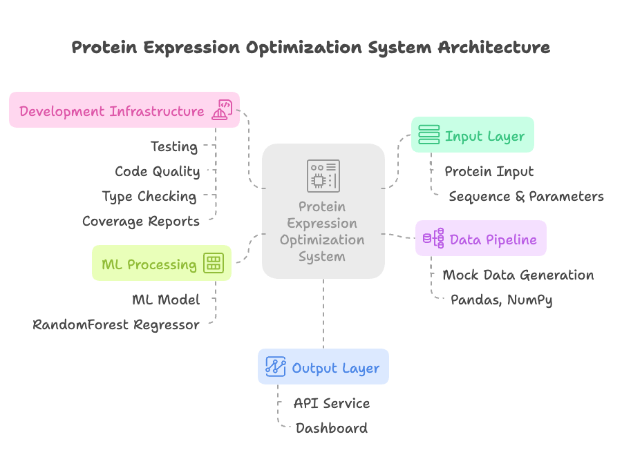

# Protein Expression Optimization System

[](https://www.python.org/downloads/)
[](https://fastapi.tiangolo.com/)
[](https://streamlit.io/)
[](https://scikit-learn.org/)
[](https://github.com/psf/black)
[](https://opensource.org/licenses/MIT)
[](https://github.com/keltoumboukra/protein-optimizer/actions/workflows/ci.yml)
[](https://codecov.io/gh/keltoumboukra/protein-optimizer)

## Test Coverage Overview


A data-driven platform that helps researchers optimize protein expression conditions using machine learning. This tool predicts expression levels and solubility based on experimental parameters, helping streamline the protein production process.



## Project Structure

```
protein_optimizer/
├── dashboard/           # Streamlit visualization interface
├── src/
│   ├── api/            # FastAPI backend service
│   ├── data_pipeline/  # Data processing
│   └── ml_models/      # ML prediction models
├── tests/              # Test suite
└── data/               # Data storage
```

## Key Features

- **ML-Powered Predictions**: RandomForest models for expression and solubility prediction
- **Interactive Dashboard**: Real-time data visualization
- **REST API**: Integration with lab workflows
- **Development Tools**: Comprehensive testing and type checking

## Quick Start

1. Set up environment:
```bash
python -m venv venv
source venv/bin/activate  # On Windows: venv\Scripts\activate
pip install -e ".[dev]"
```

2. Start services:
```bash
# Start API (http://localhost:8000)
uvicorn src.api.main:app --reload

# Start Dashboard (http://localhost:8501)
streamlit run dashboard/app.py
```

## Development

```bash
# Run tests with coverage
pytest --cov=src tests/

# Format code
black .

# Type checking
mypy src/
```

## License

MIT License - feel free to use and modify as needed.
